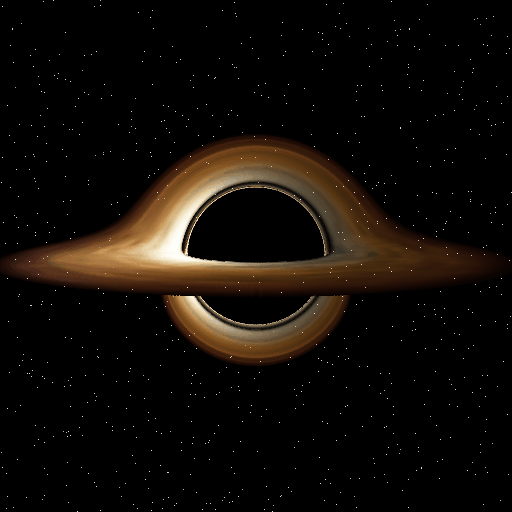

# Quantum Recursion

*(Repository, module and code names still say `LootboxRecursion` from the original Rails prototype. Renaming those isn't worth the churn.)*

A sci-fi crafting, loot box and radiation-processing game on a 3D grid, built with
**Unreal Engine 5.8** and C++.

Humanity has learned to harness a black hole as a *universe inside a universe*. From a
facility outside the event horizon, you inject elementary matter (carbon, iron) into the
pocket universe. There you compress it into **Quantum Caches**, sealed packages whose
contents stay undecided until they're observed, and build machines on its grid. There's no
character: you are the operator, looking in from outside.



It's a port of the Rails/Vue prototype
[`belackriv/lootbox_recursion`](https://github.com/belackriv/lootbox_recursion). All the game
rules are ported:

- injecting matter (Rails "scavenge")
- crafting
- loot tables with modifiers
- opening boxes, including boxes inside boxes
- deploying and recalling entities, now on a 3D grid
- **new:** irradiating loot boxes in enclosures with radiation sources
- **new:** a data-driven tech tree: recipes and actions unlock as you play
- inventory sort and compress

It also adds save/load, a 3D view of the grid, and carbon and iron irradiation enclosures.

> **Status: first playable skeleton, not yet compiled.** The code was written without an
> Unreal Engine install available. The simulation logic was compiled and its tests run
> against a mock of the engine types, and the engine-facing code was reviewed by hand, but
> the first real build may still turn up a few compile errors. If it does, paste the errors
> into a Claude session with this repo.

---

## Quick start (Windows)

### 1. Install the toolchain (one time)

1. **Epic Games Launcher**, then Unreal Engine → Library → install **5.8** (5.7+ should also work).
2. **Microsoft's C++ compiler.** Unreal compiles with MSVC on Windows. Pick one:
   - **Build Tools for Visual Studio** (free, compiler only, no IDE). This is enough if
     you edit in Zed; see [Using Zed](#using-zed-instead-of-visual-studio).
   - **Visual Studio Community**, if you want the full IDE and debugger.

   Either way, select the *Desktop development with C++* workload. Then, under
   *Individual components*, make sure these are checked:
   - a **Windows 10/11 SDK**
   - the latest **MSVC v143** build tools
   - **.NET Framework 4.8 (or 4.8.1) SDK** and its **targeting pack**. Without these the
     build fails with *"Could not find NetFxSDK install dir"*.

   Use the version Epic lists for your engine:
   [Setting up Visual Studio](https://dev.epicgames.com/documentation/en-us/unreal-engine/setting-up-visual-studio-development-environment-for-cplusplus-projects-in-unreal-engine).
3. **Git LFS**: run `git lfs install` once. It's needed as soon as you commit maps or
   assets.

### 2. Build and run

```bat
git clone https://github.com/belackriv/lootbox_recursion_game.git
cd lootbox_recursion_game
```

- **Easiest:** double-click `LootboxRecursion.uproject`. It will say the
  *LootboxRecursion module is missing* and ask to rebuild. Click **Yes**. If the build fails,
  run `Tools\build.bat` (or use the IDE route) to see the errors.
- **Zed / command line:** run `Tools\build.bat`, then `Tools\editor.bat`. See
  [Using Zed](#using-zed-instead-of-visual-studio).
- **IDE route:**
  1. Right-click `LootboxRecursion.uproject` → *Generate Visual Studio project files*.
  2. Open `LootboxRecursion.sln` and choose the **Development Editor / Win64** configuration.
  3. Press **F5**. This builds and launches the editor with the debugger attached.

In the editor, press **Play** (Alt+P).

> If you have a different 5.x engine installed, right-click the `.uproject` → *Switch Unreal
> Engine version...*. Nothing here is specific to 5.8.

### 3. Playing

| Input | Does |
|---|---|
| Click **Inject Matter** | Receive 25–34 carbon or iron (5s cast) |
| Click a **Craft** recipe | Quantum Cache (50/50), enclosures, radiation sources (as they unlock) |
| Click a Quantum Cache in the inventory, then **Use** | Open it (collapse it) |
| Click a grid cell, then **Deploy** | Place the selected (or first) enclosure there. With an enclosure selected in the inventory, the cursor shows a preview. |
| Select an occupied cell, then **Recall** | Pick it back up |
| Select an enclosure, select a cache or radiation source in the inventory, then **Load** | Irradiate the cache. Each exposure adds a modifier; X-rays observe it (revealing and fixing the contents). **Unload** when done. |
| **Sort** (inventory title bar) | Compress and alphabetize stacks |
| Select a slot, then **Annihilate** (inventory title bar) | Destroy that whole stack |
| Hold `W`/`A`/`S`/`D` or arrow keys | Pan across the grid |
| Mouse wheel | Zoom |
| Hold right mouse and drag | Free look: orbit and tilt |
| Hold `Q`/`E` | Orbit the camera |
| `PageUp`/`PageDown` or `]`/`[` | Build layer up / down (Z) |
| Click a row in the **Grid** panel's list | Select that entity and fly the camera to it |
| `R` | Reset camera angle and zoom |
| `H` / **Home** | Fly to the first deployed entity (or the origin) |
| `~` | Console: `LRGive carbon 500`, `LRTimeScale 10`, `LRItems`, `LRSave`, `LRReset` |

New games start with just **Inject Matter**. Everything else unlocks as you play (see *Tech tree* in [docs/DESIGN.md](docs/DESIGN.md)); the log announces each unlock.

The game autosaves every 30s and on exit to `Saved/SaveGames/LootboxRecursion.sav`. Use
`LRReset` to start over.

---

## Using Zed instead of Visual Studio

You only need the compiler (Build Tools for Visual Studio), not the VS IDE.

1. Build once. Either run the task **UE: Build** (Zed → `task: spawn`) or run
   `Tools\build.bat`.
2. Run **UE: Generate compile_commands.json**. It writes the file to the project root, and
   Zed's clangd picks it up for completion, go-to-definition and errors. The first index of
   Unreal's headers takes a while. Re-run it after adding new source files.
3. In Unreal, open Editor Preferences → Source Code and set **Source Code Editor** to
   *Null*, so the editor stops trying to launch Visual Studio.

The Zed tasks (`.zed/tasks.json`) call the scripts in `Tools/`, which work from any terminal:

| Task | Script | Does |
|---|---|---|
| UE: Build | `Tools\build.bat` | Compile the editor module |
| UE: Generate compile_commands.json | `Tools\gen_compile_commands.bat` | clangd database |
| UE: Open editor | `Tools\editor.bat` | Launch Unreal Editor with the project |
| UE: Play standalone | `Tools\play.bat` | Run the game windowed, without the editor |
| UE: Run automation tests | `Tools\test.bat` | Headless test run |
| Data: Validate JSON | `Tools/validate_data.py` | Check `Content/Data` |

The scripts find Unreal through the Epic Launcher's registry entry, or fall back to
`C:\Program Files\Epic Games\UE_5.8`. If that fails, find your install with:

```powershell
(Get-Content "$env:ProgramData\Epic\UnrealEngineLauncher\LauncherInstalled.dat" | ConvertFrom-Json).InstallationList | Where-Object AppName -like 'UE_*' | Select-Object AppName, InstallLocation
```

Then run `setx UE_ROOT "<that InstallLocation>"` and restart Zed.

**Iterating:** with the editor open, **Live Coding** (Ctrl+Alt+F11 in the editor)
recompiles `.cpp` edits in place. After header changes, close the editor and run
**UE: Build**.

**Debugging:** Zed's debugger doesn't handle MSVC-built Windows binaries well yet. For
stepping through C++, attach Visual Studio Community or Rider to `UnrealEditor.exe` when
you need it. Most day-to-day debugging is `UE_LOG` plus the Output Log.

---

## First steps in the editor

The repo deliberately contains **no binary assets**, so it's fully reviewable in a diff.
Your first commits should add some:

1. **Make a real level.** Go to File → New Level → **Basic** (it has a sky, sun and floor).
   Save it as `Content/Maps/Main`.
2. **Make it the default.** In Edit → Project Settings → *Maps & Modes*, set
   **Editor Startup Map** and **Game Default Map** to `Main`. That updates
   `Config/DefaultEngine.ini`.
3. Press Play. `LRGameMode` sees the level already has a sun, so it only adds the grid
   and HUD.
4. Commit the level with Git LFS. Check with `git lfs ls-files`.

From there, see [docs/ROADMAP.md](docs/ROADMAP.md) for good next steps: icons, a loot box
opening effect, and UMG panels.

---

## Project layout

```
LootboxRecursion.uproject
Config/                     DefaultEngine.ini (maps, game mode, renderer), DefaultGame.ini, DefaultInput.ini
Content/Data/*.json         Game data: items, recipes, loot tables, actions, radiation   <- tweak the game here
Source/LootboxRecursion/
  Data/                     FLRGameData: JSON definitions and validation
  Simulation/               FLRSimulation: the rules, as plain C++ with no world or actors (the "models")
  Game/                     Engine glue: subsystem, save game, game mode, controller, camera, world view, HUD actor
  UI/                       Slate HUD and its style (the "Vue components")
  Cosmos/                   The animated backdrop: starfield, void, black hole compositor
  Tests/                    Automation tests (the "Minitest suite")
Tools/validate_data.py      Validate the JSON without launching Unreal (also runs in CI)
Tools/*.bat                 Build / editor / play / test / clangd helpers (used by .zed/tasks.json)
Tools/cosmos/               Black hole ray tracer that bakes Content/Cosmos/BlackHole.lrbh
Content/Cosmos/             The baked black hole lookup table (plain binary, read at runtime)
docs/                       Porting notes, Unreal primer, design notes, roadmap
```

The architecture in one breath:

- `ULRGameSubsystem` owns an `FLRSimulation`, ticks it, and saves and loads it.
- The Slate HUD and the 3D world actor read from the subsystem and send it commands.
- Everything the HUD can do is also exposed to Blueprints.

## Documentation

- [docs/PORTING_NOTES.md](docs/PORTING_NOTES.md): where every Rails concept went, plus the
  behaviour changes.
- [docs/UNREAL_PRIMER.md](docs/UNREAL_PRIMER.md): modern Unreal for someone who last touched
  UnrealScript.
- [docs/DESIGN.md](docs/DESIGN.md): game design, radiation tables, 3D grid and logistics
  ideas.
- [docs/ROADMAP.md](docs/ROADMAP.md): suggested next milestones.

## The backdrop

`ALRCosmosActor` puts the pocket universe in space:

- a black void and ~3000 stars with a faint galactic band
- the black hole

The black hole was **ray-traced offline**: real Schwarzschild light bending, a lensed
accretion disk, and the photon ring. `Tools/cosmos/generate_black_hole.py` does the tracing
and bakes the result into `Content/Cosmos/BlackHole.lrbh`. At runtime,
`FLRBlackHoleRenderer` composites 30 frames a second from that table:

- the disk turns at Keplerian speed, so inner orbits are faster and its turbulence shears into spirals
- relativistic beaming brightens the side orbiting toward you
- the photon ring pulses

It uses only engine content, so no art assets are needed.

- **Settings:** position, size, roll and brightness are under
  `[/Script/LootboxRecursion.LRCosmosActor]` in `Config/DefaultGame.ini`.
- **Hidden during play:** the level's sky atmosphere, clouds, fog and a `Floor` mesh. A level
  made from the Basic template has all of them; the level file itself isn't changed.
- **Changing the physics** (inclination, disk radii, resolution): edit the constants at the
  top of the script and re-run it (`pip install numpy pillow`; a full bake takes ~7 minutes).
  Use `--preview-only` to re-render `docs/images` without re-tracing.

## Tweaking game data

Edit `Content/Data/*.json`. Keys are camelCase versions of the C++ fields in
`Source/LootboxRecursion/Data/LRGameData.h`. Then:

```bash
python Tools/validate_data.py      # catches bad ids, ranges, missing actions
```

Data is loaded when the game starts, so press Play again to pick up changes. No rebuild is
needed. If the data is invalid, the HUD shows a red error and saving is disabled.

## Tests

In the editor: Tools → **Session Frontend** → *Automation* tab → filter `LootboxRecursion`
→ Start Tests.

Headless:

```bat
"C:\Program Files\Epic Games\UE_5.8\Engine\Binaries\Win64\UnrealEditor-Cmd.exe" ^
  "%CD%\LootboxRecursion.uproject" ^
  -ExecCmds="Automation RunTests LootboxRecursion;Quit" -unattended -nopause -nullrhi -log
```

To build without the editor:

```bat
"C:\Program Files\Epic Games\UE_5.8\Engine\Build\BatchFiles\Build.bat" ^
  LootboxRecursionEditor Win64 Development -Project="%CD%\LootboxRecursion.uproject" -WaitMutex
```
